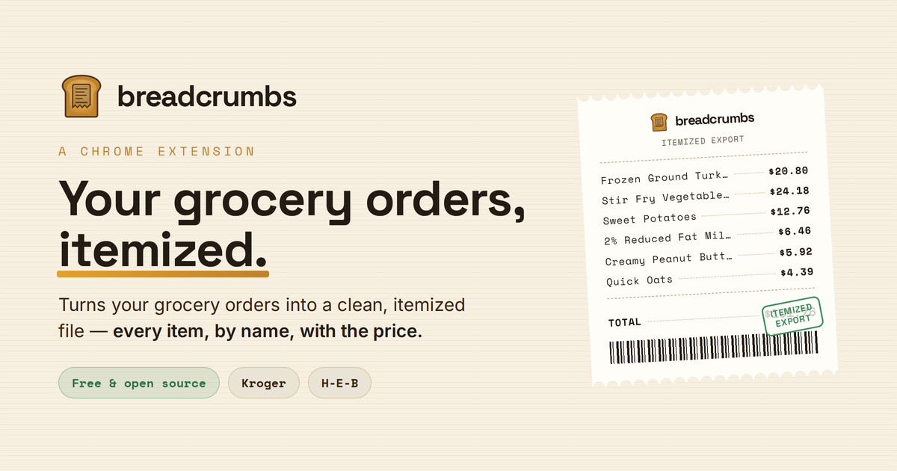

# Breadcrumbs

> A Chrome extension that pulls **itemized** purchases straight from your logged-in retailer tab and exports them for Monarch Money and self-hosted price history.

Monarch only ever sees a single lump charge for a purchase — never the line items. Breadcrumbs closes that gap: it reads the itemized receipt off your own Kroger, H-E-B, or Amazon order page and hands Monarch the real breakdown, so spending becomes searchable, categorizable, price-trackable data instead of one opaque number.

## Repository layout

Breadcrumbs is one private repository and one project:

- `extension/` — the explicit-click Chrome/Edge capture surface;
- `history/` — the self-hosted price-history API and dashboard; its tracked systemd unit is
  `history/deploy/systemd/breadcrumbs-history.service`;
- `docs/` — retained marketing-site source; publication is currently disabled;
- root scripts — the legacy local export and plan-gated Monarch workflow.

Runtime databases, dependencies, browser profiles, logs, and credentials are deliberately gitignored.

## Privacy

Breadcrumbs reads only the page you're already looking at, in the browser you already logged into. It never
logs in for you or automates around bot protection. Export remains local JSON unless you explicitly click the
history-sync control, which sends the complete capture over your tailnet to the self-hosted `history/` service.

The legacy Playwright fetcher's authenticated browser profile is runtime state, not source. On Alpha it
lives at `~/.local/state/breadcrumbs/browser-profile`; Docker mounts that directory at
`/app/.kroger-profile`. Do not recreate `.kroger-profile` inside the repository.

## Why an extension instead of a headless fetcher

The original approach drove an automated browser, which Kroger's bot protection (Akamai) blocks outright — it refuses automated sessions before you even reach the login page. Breadcrumbs takes the honest path around that: it runs inside the normal tab **you** opened and logged into, so the page is already loaded and already past Akamai. The extension only *reads* what's on the screen — it never logs in, automates, or disguises anything.

The tradeoff: it isn't a hands-off cron job. You open your orders page and click a button. In return it's reliable and doesn't fight anything.

## Install (unpacked)

Not on the Chrome Web Store yet — load it unpacked:

1. Open `chrome://extensions` and enable **Developer mode** (top right).
2. Click **Load unpacked** and select the `extension/` folder.
3. Pin the Breadcrumbs icon if you like.

## Use

1. Open a supported retailer's purchases page, logged in as normal.
2. Click the Breadcrumbs icon → **Gather recent orders**. On a purchase-list page it finds your orders and briefly opens each detail page in a background tab to pull the line items. **Follow the whole trail** walks the retailer's available history; Amazon uses its visible year filters and real Next links.
3. Click **Export JSON** to save `breadcrumbs-orders.json`.

The **Selectors** panel is there when you need it — to set the order-link pattern for multi-order scans, adapt to a Kroger layout change, or add another retailer. Click **Inspect page** first: the log shows whether the page exposes embedded JSON and which link patterns match your orders (a fuller dump prints to the page's DevTools console under `[breadcrumbs]`). Fill in the Order-link and Item row / name / price selectors, then **Save selectors**.

## Handing off to Monarch

`breadcrumbs-orders.json` is an array of `{ retailer, id, date, total, items: [{ name, qty, price, unitPrice }] }`. Legacy exports without `retailer` remain Kroger-compatible. Feed it to the Monarch reconcile flow (`MONARCH_HANDOFF.md` / `monarch_reconcile_prompt.md`): the agent matches each order to its posted Monarch transaction and splits it by category. Only the *fetch* stage moved into the browser — the rest of the pipeline is unchanged.

## Notes & limits

- Deep scan opens up to 25 orders per run in background tabs; adjust in `popup.js` if needed.
- Everything happens locally; your account data never leaves the browser except in the file you export.
- New retailers are added by dropping their domain into `host_permissions` in `manifest.json` and giving them their own selectors — the same content script works anywhere you're logged in.

## How it works: the Amazon adapter (verified August 2026)

Amazon's **Your Orders** page exposes real order-detail links and a GET-based year filter. Breadcrumbs reads those visible controls, follows each real Next link, and extracts order IDs, dates, totals, item names, ASINs, quantities, prices, and fulfillment text from the rendered detail pages.

Amazon item cards show the gross unit price while Subscribe & Save and other basket discounts appear only in the order summary. Breadcrumbs proportionally allocates those item discounts across the captured lines, preserves the gross value as `unitPrice`, and leaves tax and net shipping outside item prices. This keeps `price` equal to the amount paid for the merchandise rather than Amazon's pre-discount display price.

## How it works: the Kroger adapter (verified June 2026)

Hard-won specifics so this doesn't have to be re-derived (incl. for the Safari rebuild). Kroger ships **no embedded JSON** (`__NEXT_DATA__` absent) and uses build-hashed `citrus-*` class names that change between deploys — so anchor on `data-testid` and visible-label text, never on classes.

**Pages.** The order list is `kroger.com/mypurchases`. Each order has two detail views:
- `/mypurchases/image/<id>` — the printed-receipt image; **payment summary only, no line items.** Don't scan this one.
- `/mypurchases/detail/<id>` — the **itemized** view with one card per product. This is the scan target.

**Selectors / parsing (baked in as defaults in `content.js`):**
- Item row: `[data-testid^="list-style-product-card-"]` (cards are numbered `-0`, `-1`, …).
- Item name: `[class*="Product-title"]`, falling back to the row's first link, with "Save to List" stripped.
- Unit (shelf) price: `[data-testid="product-item-unit-price"]` — renders as `$10 . 00`, so prices are de-spaced.
- **Quantity & paid:** parsed from the card's own text via regex — `Received:\s*(\d+)` and `Paid:\s*\$([\d.]+)`. This matters: the unit price is the *sticker* price; **`Paid` is what actually hit the card** (e.g. turkey 4× → unit `$10.00`, paid `$40.00`; rice coupon `$3.69` → paid `$3.19`). `price` = paid, `unitPrice` kept as secondary.
- Order total & date: regex on the summary panel text — `Total:\s*\$([\d.]+)` and `Order Date\s+(<Month D, YYYY>)`. Note the summary's **Order Date can differ from the date in the URL** (URL said 06-11, order was June 10); the summary is authoritative.

**Verified output shape:** `{ id, date, total, items: [{ name, qty, price (paid), unitPrice }] }`. On a known 3-item order the paid amounts summed exactly to the captured total ($40.00 + $3.19 + $3.49 = $46.68).

**Still TODO:** the multi-order `DEEP_SCAN` (walk `/mypurchases`, open each order's `/detail/` view) — the list-page order-link selector and a tweak to prefer `/detail/` over `/image/` are the remaining pieces.

## License

MIT © 2026 [@davidisdeploying](https://github.com/davidisdeploying)
